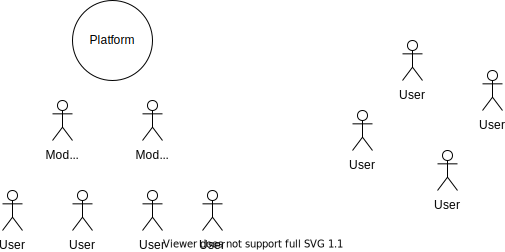

We haven't associated 'harmony' with centralized web for a long time, and this is right, for there are various forms of spyware, malware and viruses. One of decentralized networks, ZeroNet, is named so probably because it aimed to start from zero where the centralized originates as well. Though it was indeed undeveloped, the developers and users supported the network and funded the project. The author of the network does have received much funds, but the developers of other sites didn't. It is all about contribution and gratitude. The discussion sites on it don't need much maintenance since the users generally appreciate the network, while the moderators of centralized sites are getting exhausted clearing the spammers. When you are trying to get some software, the malwares are downloaded unexpectedly. Then, *how is the centralized web harmonious ? Is it natural to be like this, and even no one has questioned it ?* The reason behind is that the centralized web lacks trust, even though everyone isn't necessarily anonymous and is constantly being monitored by internet monoplies. They can't trust each other as well, for everything is actually done by the platforms, so the users can only trust platforms which are not trustworthy at all. Does harmony really matter ? It seems harmony is only the relationships between users, and we can just go head and use AI to filter out spammers which does work to some extent. It is about the development of internet, however. **Opensource develops because of harmony**, and today it has achieved many great projects. Harmony isn't simply about the spamming. 

'Modern' websites have been trying to establish relationships between users, which is called user-stickiness/reliance(用户粘性). It is a great way of getting users stuck in their platforms and further reduce the chance of other competitors, and users are more well-bahaved. The harmony does *not* happen, however, since the establishment of relationships is *only* a strategy of the platform. The stickiness comes from the need of communicating with friends, which has nothing to do with the app. They can communicate if they use another app too. Except for the friends, what can happen between two complete strangers on some website, and does it matter to the management or desicision making of the website. As a result, the spammers appear and the attackers are constantly flooding websites. They users don't really have true relationships on the centralized web, which are insignificant to the site owners. In a dweb, all people share resources, files, and some of them are site runners. They trust each other and have relationships as long as they use the network, which happens because they share things, and the trust appears during their mutual help. The trust also happens on another layer, where projects, sites are funded. *Then they don't trust the owners of a centralized site, but directly help each other instead*, which is exactly how dweb works. Dweb won't work without the spirit of helping.

> Typically, users are **semi-anonymous**, so the relationships appear, but the centralized platforms greatly interfere this process.

Dweb is a network of users' very own, where they are no longer customers of some platform, but run the network for themselves.

We see all sorts of internet bureaucracy, from the simple hierarchy of a small forum where the site owner has the ultimate power and he gives the permission to different levels of moderators, to the more modern one of some larger platforms where the power is more distributed and the procedure is better designed. The phenomenon seems to be very natural, since the reality world always has governments which represent the people to some extent. The very feature of internet actually makes anarchism possible, which is exactly a purpose of decentralization. If one small group of people have got the power, then they have the chance of violating the demand of people. An argument is to rely on the competition of platforms, so that a bad-bahaving platform will be replaced soon after they have did something critical. The compeitition doesn't work, as the platform will only be replaced when it is really unbearable for most of its users. Even in dweb, it is still possible that the site owner with much power would do something similar. Therefore, it is never a solution to have a small representation group of people with great power. 

How the people govern themselves ? The answers differ depending on how we define the goal of governing and what sites should be like. If a website is to enable users to host files, then most current dweb are capable of that, which is mostly done by the algorithm itself without any human operation. To this definition and goal, we have already done the anrachism of a cloud hosting website, like Google cloud or 百度云(Baidu cloud) in China. Then the question is, how is the bureaucracy of such kind of websites necessary ? This is t**he first kind of site where we have achieved anarchism**, with living examples. Websites of the second type have to deal with different opinions, the centralized kind of which uses its power to enforce that only one opinion is adopted. The opinion can be, for example, what should be shown as the best article on a platform, what topic should be displayed at the top, or whether some content is allowed on a site. Sites of the first kind are not the second kind becase of the hash algorithm which maps the hash with the corresponding content exactly, so that there's absolutely no disputes on this, which is a network-wide consensus. For the second type, we have several choices offered by the dweb, to turn to the **subjective WoT**, or the group of elected moderators, or even the mix of the two where both strategies have a certain influence on the final decision. The subjective WoT means that everyone has one's own distinctive network of friends, which furthers the idea of people governing themselves to friends governing themselves for a goal, which is obviously harmonious.