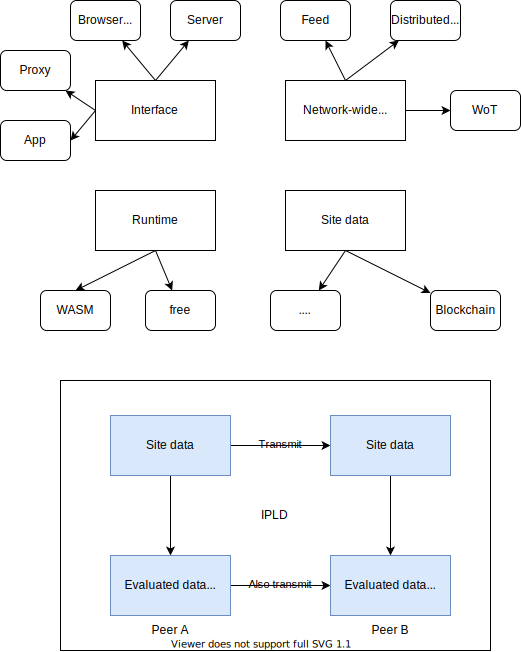

# Design of the protocols

> 2021

The diagram shows the general evolution of related projects.

## Arch

## Protocols present

- Bitswap with DHT
  - Only works if the blocks are static, immutable, since the records on DHT are not to be changed
- Gossip
  - Not suitable for large amounts of data

(An object can't exist without a site)

## Site

## Object

## Encoding

To some specific peer

- Utility rate of the base block by the current block
- Overall utility rate of the base block
  - Possiblity of being required again by other blocks
    - Possibilty of requring the blocks that require the base block
- Difficulty of fetching
  - Size
  - Seeders

