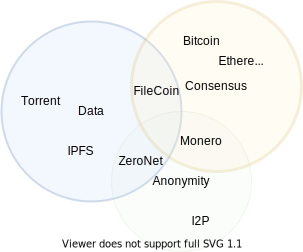
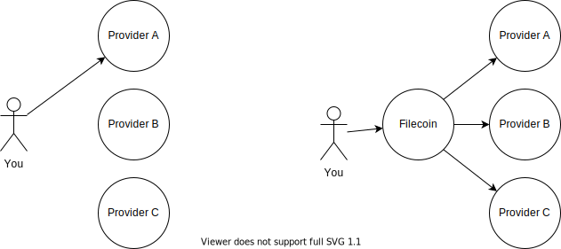

> simple intro written for some of my readers

# Dweb in a nutshell

> Dweb is a proper noun that means 'decentralized web'.

The current internet structure is centralized, which means the corporations run computing centers with large upload bandwidth and people generally get data only from these data centers. The direct consequences are that the privacy of users is constantly being robbed and monetized, as the global capitalism develops, which is caused by the centralization of influence since some application or website is used by plenty of users. They can use the influence to do anything, including putting ads anywhere, getting revenue as a middle man, and even affect the politics. The centralized model also makes it easy for censorship. For example the GFW can just use a blacklist to block any unwanted entities. In terms of technical efficiency, the competition and protocol barriers between companies block any possibility of reusing codebase and data which will happen in dweb. Most sites are similar at some extent, for example, video sites, social media and instant messengers, which all have the same content hosted multiple times and similar technical architecture. The three categories can have a common template that other new sites can be created from, which is the key of reducing the cost of introducing new competitors that benefit users, which is possible on dweb.

The dweb connects users instead of companies, which reduces the intermediaries such as an instant messenger between users. If people originally download content from the data centers, then now they download from each other, by uploading to others. Such model doesn't produce unnecessarily large monopolies. If the traditional web is considered to have reduced the intermediaries between customers and producers, from like three agents to one platform, the dweb directly reduces it to zero, by **user autonomy** with rules executed by the algorithm.  The count of users is far greater than the servers corporations have, which means we have more IPs. GFW doesn't want to interfere the international commerce, so it tries to distinguish the 'illegal' traffic from 'legal' traffic. However, we will always have more developers than GFW, so we can disguise the traffic to make it look more 'legal'.

There are many types of dweb applications, as shown (classified by purpose), including the most well-known one, blockchain which has the ability to reach a consensus over the network. Even blockchain itself still relies on other types of decentralized networks which are hence crucial and fundamental, for example, the anonymity-oriented crypto-currency Monero needs I2P for transport-level anonymity, and Filecoin, a market that trades the service of storing and transmitting data, heavily depends on a decent data exchange protocol.

> Content-addressing: Addressing content by its hash, instead of location（以哈希编址，而非存储位置）

The history of dweb dates back to 2000, when Gnutella was firstly introduced. Then in 2001, the concept of content-addressing was implemented by BitTorrent, which developed DHT algorithm four years later. These are the fundamental algorithms for the later networks which have more innovations in other aspects. The latest technologies in this field are IPFS and ZeroNet, respectively featuring modularity and diverse media, which is also where the idea of The Network comes from. However, in my opinion, they all have failed to replace the centralized web.

Imagine you are going to deploy a server for your personal blog, and you are looking for such service with Google. Firstly, you are motivated enough to use Google and take some minutes to find a provider and take another tens of minutes to register an account and make location choices. Secondly, you won't reach the optimal choice, as the search results are biased and you don't have the effort to check every provider. This is what is happening right now. FileCoin, as one of the diverse applications of dweb, solves this problem by protocol and automation. Each service provider will publish an record on Filecoin blockchain, by which you will find them. You buy some coins and ask it to serve your website, which will automatically look up the records and send them your data to multiple service providers. Filecoin will regularly ask the providers to prove they are serving your files, through some algorithm, and they pay them. Visitors of your blog will view it on Filecoin, which Filecoin also ensures to be as fast as possible by automatically checking the speed of candidates and selecting the optimal.
